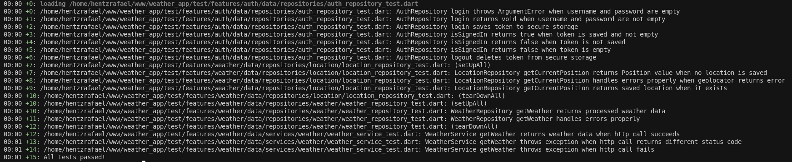
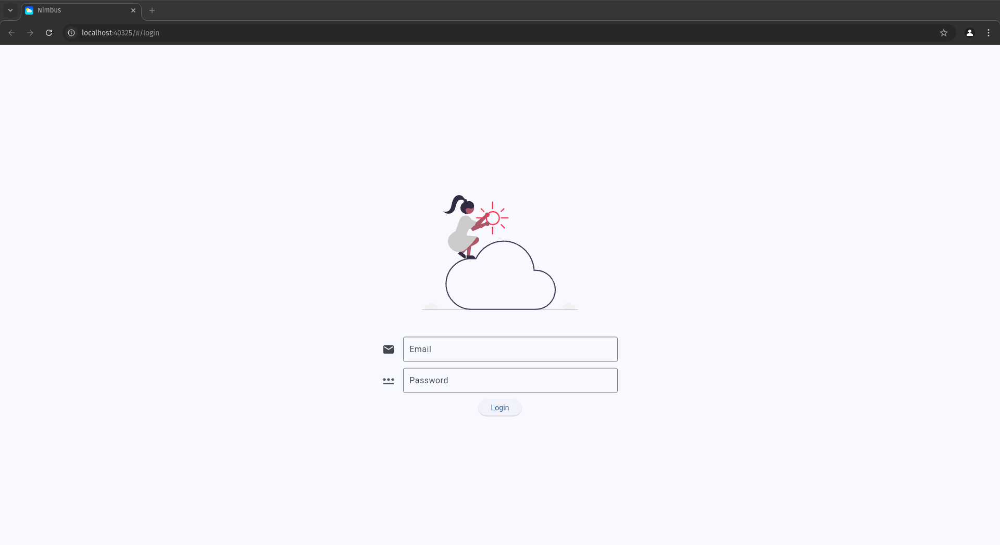
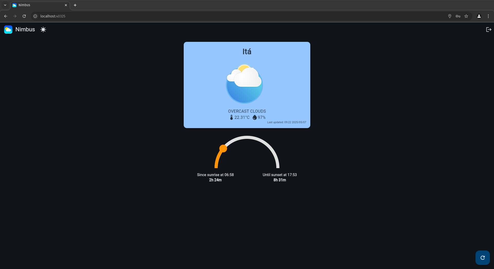
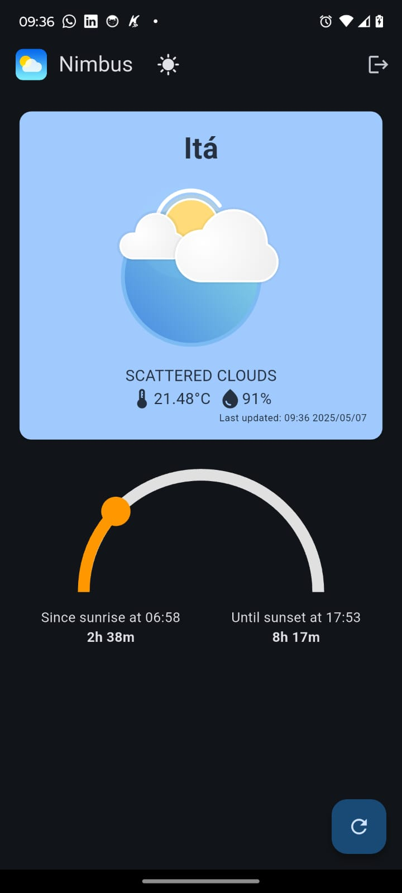

##  Nimbus

In this document, I explain some features implemented and some decisions taken into account during development.

---

### Running the application
The application was made only with Flutter and has the support for mobile (Android and iOS) and web devices. To run it:

1. Clone this repository
2. Create a `.env` file inside of assets, following the model of `.env.example`.
3. Run `flutter run -d <device of your choice>`
4. Enjoy :)
---
### Architecture

I followed a mix of Clean Architecture and MVVM, having my project divided into three layers:
1. data
2. ui
3. domain

These layers are inside each of the features folder, to keep everything clean and organized. For common configurations, I created an `app` folder inside lib to store it, and for other utilities, a `core` folder.

Following SOLID principles, I created abstractions between the layers to define which methods I need from services and repositories, making changing to a different Weather API easy as creating a new Service, for example.

---

### Stack
I've used Flutter alongside other packages from pub.dev:
- go_router for route handling.
- dio for HTTP requests.
- provider for Dependency Injection.
- flutter_secure_storage for local and secure device data
- flutter_svg to use SVGs
- geolocator to gather location data from device
- freezed/json_annotation to handle API models and validation
- flutter_dotenv to store my API KEY securely
- lottie for animations
- intl for date formatting

To choose these packages, I took into account the size of the project and complexity that I was dealing on it. Instead of using Riverpod for state management, I used `provider` with `ChangeNotifier` to keep it simple and performant, as the state of this application is not complex.

I also used `mockito` to test my services and repositories, keeping the behaviour for these classes controlled and predictable.

___

### Frontend

#### Login Page

This page has a simple form to simulate the real user experience of a login system. It doesn't contain all the features needed to implement a secure login, like JWT token auth and cryptography, but all of this can be easily implemented. 

To simulate login, I'm validating the user input and storing a dummy token on my FlutterSecureStorage.

Future changes
1. Add JWT authentication
2. Use SHA-1 or any cryptography algorithm to encrypt data.

#### Weather Page

This is the main page of the app, it will prompt you to allow access to your location, and, if you grant it, it will make a request to gather Current Weather information of your place.

As it is, you can't change to a specific location or save some coordinates to always check the weather. Instead, you have access to a FloatingActionButton on the bottom-right corner that will update your location and gather new weather data.

Also, I added a toggle to change between Dark and Light Themes and a custom widget to show how much has passed since sunset and how much sun time is left in your location.

As for the icon, it is related to the status and time of your weather. If it's night, it will show you the corresponding animation to night, and so on.

Here is the mobile version:

Future changes
1. Add location saving
2. Add forecasting 
3. Review the design

### Design 
I've used Flutter Material for making my widgets and screens, one of the requirements is to implement web and mobile interfaces. As the project is small and does'nt contain so much information, I used the same Widgets for mobile and web, only controlling the size of them with Expanded and ConstrainedBox to keep a good UI on both screens.

Future changes
1. Consider some different design

--- 
### Deployment
I tested the build command on web and android and it's working properly.

---
### What would you improve if given more time?

- Add forecasting
- Review design decisions
- Improve test coverage
- Implement authentication

---
### That's it!
Thanks for your time, and if you have some issues and suggestions. Contact me on my [E-mail](mailto:hentz.dev@gmail.com) :)

Rafael Augusto Hentz